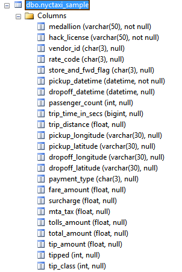

# Diccionarios de datos
Lugar donde se colocan los documentos de descripción de datos, normalmente recibidos de un cliente.
Se trata normalmente de una descripción a nivel de campo de los archivos de datos recibidos.

Este documento proporciona las descripciones de los datos que proporciona el cliente. Si el cliente está proporcionando diccionarios de datos en texto (en correos electrónicos o archivos de texto), cópielos directamente aquí, o tenga una imagen del texto, y agréguela aquí como una imagen. Si el cliente proporciona los diccionarios de datos en hojas de cálculo de Excel, coloque directamente los archivos de Excel en este directorio y añada un enlace a este archivo de Excel.

Si el cliente le proporciona los datos desde un sistema de gestión de datos similar a una base de datos, también puede copiar y pegar aquí el esquema de datos (instantánea). Si es necesario, proporcione también una breve descripción de cada columna después de la imagen de la instantánea, si dicha imagen no tiene esa información. 

## <Nombre del conjunto de datos 1 (de la base de datos)}

Imagen de ejemplo del esquema de datos cuando los datos provienen de un servidor sql_

## <Nombre del conjunto de datos 2 (diccionario en archivo Excel)\N-

[conjunto de datos 2 con diccionario en Excel](./Diccionario-de-datos-brutos.csv)